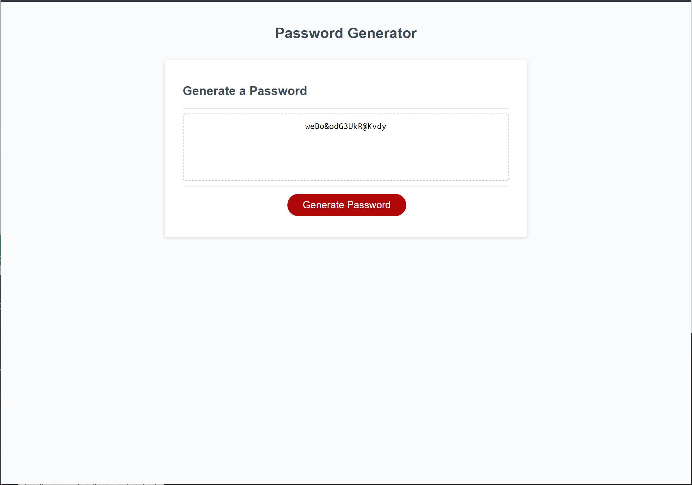

# password_generator

Select Generate Password and enter in your password criteria. You can enter in your character count and select to include lower case letters, upper case letters, numbers, or symbols. 

Password will randomly generate and be displayed for the user to copy. 

## GitHub Repo Link
https://github.com/adamnatrop/password_generator

## GitHub Live Site Link
https://adamnatrop.github.io/password_generator/

## Screenshot

